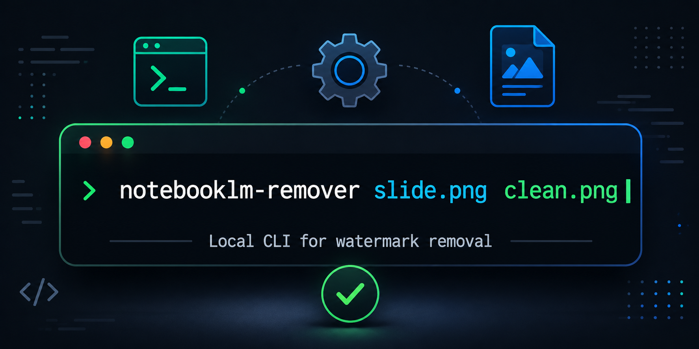

# notebooklm-remover

<p align="center">
  <a href="https://notebooklmremover.org">
    
  </a>
</p>

<p align="center">
  <a href="https://www.npmjs.com/package/notebooklm-remover"></a>
  <a href="https://www.npmjs.com/package/notebooklm-remover"></a>
</p>

Remove NotebookLM watermarks from slide screenshots and infographic images — directly from your terminal. Uses connected component analysis with adaptive thresholding to detect and cleanly fill the watermark region.

Part of the [NotebookLM Remover](https://notebooklmremover.org) toolset.

## Install

```bash
npm install -g notebooklm-remover
```

## Usage

```bash
# Single image
notebooklm-remover slide.png cleaned.png

# Batch process all images in a folder
notebooklm-remover ./slides/ ./output/

# Adjust detection sensitivity (lower = more aggressive)
notebooklm-remover slide.png cleaned.png --threshold 45
```

## Node.js API

```javascript
const { removeWatermark } = require('notebooklm-remover');

await removeWatermark('input.png', 'output.png', {
  threshold: 60,
  scanW: 0.22,
  scanH: 0.08,
});
```

## How It Works

1. Scans the bottom-right region of the image where NotebookLM places its logo
2. Calculates the background median brightness in the scan area
3. Detects watermark pixels using adaptive multi-pass thresholding (60 → 45 → 30)
4. Fills detected pixels by sampling from above the watermark region

Works on light and dark backgrounds. Handles both the NotebookLM text logo and icon variations.

## Options

| Flag | Description | Default |
|------|-------------|---------|
| `--threshold <n>` | Detection sensitivity | `60` |
| `--scan-w <pct>` | Scan width ratio from right edge | `0.22` |
| `--scan-h <pct>` | Scan height ratio from bottom edge | `0.08` |

## Full Toolset

This CLI handles image watermark removal. For other NotebookLM formats, the [online tool](https://notebooklmremover.org) covers everything — video, PDF, PPTX, Gemini images, audio trimming, and metadata cleanup. All processing happens in your browser, nothing gets uploaded.

- [Video watermark removal](https://notebooklmremover.org/video)
- [PDF slide watermark removal](https://notebooklmremover.org/slides)
- [PPTX watermark removal](https://notebooklmremover.org/pptx)
- [Gemini image watermark removal](https://notebooklmremover.org/gemini-image) (lossless alpha reversal)
- [Audio intro/outro trimming](https://notebooklmremover.org/audio)
- [AI metadata removal](https://notebooklmremover.org/metadata)

## License

MIT
